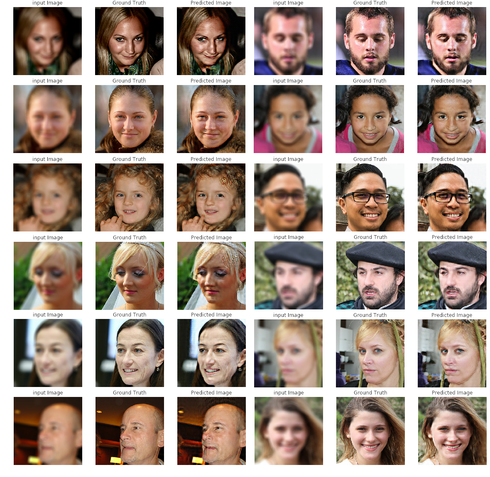

# Pix2Pix-Deblurrer

Utilizar el modelo Pix2Pix para entrenar a una IA y corregir imágenes desenfocadas.

## Recursos:

| Link                      | Descripción
| :--------------           | :----------
| https://arxiv.org/pdf/1611.07004.pdf| Paper original Pix2Pix.
| https://drive.google.com/drive/folders/1ApY0aL62D1tYwf-rgNmVnVgigpaK3jQq?usp=sharing | Más ejemplos.
| https://colab.research.google.com/drive/1sud5mrD6VnZVp8ti7CHv5Dq3MJmdseEj | Codigo original (Google Colab)
| https://github.com/NVlabs/ffhq-dataset  | Flickr-Faces-HQ dataset.
| https://drive.google.com/drive/folders/1cBsublceZhxrFgqcR_XMk1bkmAkmnKiY?usp=sharing | Carpeta Google Drive.
| https://drive.google.com/drive/folders/1PZvCYsMJVMDaJawz1w9ledmY9yWrciQc?usp=sharing | Modelo pre-entrenado (tf_ckpts)

## Requisitos:

Toda la red fue programada y entrenada desde un entorno de google Colab ejecutado de manera local en una Nvidia GTX 960 4Gb (debido a las limitaciones de tiempo de google Colab y a fallos de sincronización con google drive)

Es altamente recomendable utilizar una o varias GPUs Nvidia debido a la compatibilidad que proporciona tensorflow a las tarjetas Nvidia, existe una librería llamada ROCm para ejectuar tensorflow en GPUs AMD pero carece de la cantidad de desarrollo y soporte que tiene CUDA. 

En principio todo el codigo de este repositorio es compatible con tarjetas AMD, ya que nos funcionó con una RX 470, para utilizarla debes instalar ROCm siguiendo [estos pasos](https://github.com/ROCmSoftwarePlatform/tensorflow-upstream/blob/develop-upstream/rocm_docs/tensorflow-install-basic.md)

- Ubuntu 18 o similares
- Tensorflow 1.14
- Numpy 1.18.0
- Pillow 6.1.0
- python 64-bit 3.7.3
- GPU Nvidia
- Jupyter notebook (para el entorno local de google Colab)

Nvidia:

- Driver Nvidia 418.2 o mas reciente
- CUDA toolkit 9.0 o mas reciente
- cuDNN 7.3.1 o mas reciente

Amd:

- ROCm

## Donde conseguir las imágenes:

Nosotros utilizamos el Flickr-Faces-HQ dataset, lo puedes encontrar aquí [Flickr-Faces-HQ repository](https://github.com/NVlabs/ffhq-dataset).
Es áltamente recomendable descargar las imágenes mediante el archivo de python que se encuentra en su repositorio.

## Preprocesamiento de imágen:

Adobe Photoshop CC fue usado para modificar las imágenes del dataset FFHQ.

Para recrear nuestro dataset:
- Crear una macro en photoshop que desenfoque las imágenes originales (aquí puedes elegir el tipo de desenfoque y su intensidad, recomendamos el desenfoque de lente ya que es lo más parecido a una imágen desenfocada de forma natural por una cámara)
- Usar esa misma macro para reescalar todas las imágenes a 256 x 256 pixeles y guardarlas en formato .jpg (importante que sea .jpg y no cualquier otro)
- Exportar a una carpeta (en nuestro caso "/Blurred")
- Repetir todo pero sin desenfocar y exportar a otra carpeta (en nuestro caso "/not_blurred_resized")
- En la carpeta de google drive encontraras las primeras 11000 fotos de nuestro dataset, el resto se subirán más adelante

## Antes de entrenar:

Es necesario modificar ciertas variables en `run.py`:

- Establecer `PATH` a ser la ruta completa hasta la carpeta donde se ubica `run.py`.

- Establecer la variable `n` al numero de imágenes que deseas cargar para el entrenamiento y testeo (en un ratio 8:2)
  los resultados mostrados aqui han sido entrenados con `n = 1000` debido a nuestras limitaciones de GPU, en un sistema
  con multiples RTX 2080ti o Tesla V100 se podria configurar hasta `n = 71000` para usar todas las imagenes del dataset
  (ten en cuenta que eso incurre un costo computacional inmenso y por lo tanto tardará mucho más en completar su 
  entrenamiento, a cambio generará resultados mucho mas realistas y generalizables)
  

## El entrenamiento:

El entrenamiento emplea un `batch_size` de una sola imágen para maximizar fidelidad visual

Tensorflow automáticamente asigna recursos de hardware así que en principio no es necesario seleccionar si quieres entrenar con GPU o no, si esta disponible se usará.
Cada iteración tarda unos 6 minutos en una GTX 960 con `n=1000` y fue entrenado durante 220 iteraciones (recomendable mínimo 200 iteraciones para algunos resultados decentes, pero cuantas más, mejor)

También es posible entrenar usando la CPU pero cualquier tarjeta gráfica barata de hace unos años es minimo el doble de rápida que cualquier procesador de alta gama actual.

Si vas a utilizar otro dataset o prefieres entrenar desde cero borra todo el contenido de la carpeta `tf_ckpts`

## Evaluación y guardado

El modelo trata de mejorar las imágenes generadas mediante un valor de error determinado por `total_gen_loss = gan_loss + (100 * pixel_loss)` donde `gan_loss` es el valor de error generado por el discriminador (patchGAN) y `pixel_loss` es la diferencia media en el valor de cada pixel entre la imágen original y la generada. `pixel_loss`esta multiplicado por `100`para que sea 100 veces mas significativo que el valor del discriminador lo cual mejora los resultados según el equipo de Pix2Pix detalla en su paper (link arriba).

Todos los pesos de tanto el generador como el discriminador así como todas las variables son guardadas en la carpeta `tf_ckpts` y recupera el ultimo punto guardado al ejecutar el codigo.

## Como usar el modelo pre-entrenado:

Descargar este repositorio y modificar la variable `PATH` en `run.py` para que la ruta te lleve hasta la carpeta donde se encuentra `run.py`.

Modificar la variable `epoch_number` al numero de iteraciones de entrenamiento que quieras usar (ten en cuenta que debes establecer el numero total, si entrenas 50 iteraciones y despues entrenas otra vez con `epoch_number = 100` solo entrenará otras 50 iteraciones, esto es asi para llevar la cuenta de cuanto ha iterado aunque se interrumpa el entrenamiento)

crear una carpeta llamada `tf_ckpts` y pegar dentro todos los archivos de guardado (el ultimo link de arriba)

## Anexo

Asegurate de que en la misma carpeta que `run.py` existe:
- Un archivo llamado `epochs.txt` con una única línea escrita donde ponga `0`
- una carpeta llamada `output`, `output_2` y `tf_ckpts`
- Si utilizas tu propio dataset asegúrate de que tus imágenes sean de `256 x 256`, y que en tus 2 carpetas tengas 
  exáctamente el mismo número de imágenes y que el nombre de cada archivo de una carpeta sea exáctamente igual a cada 
  correspondiente imágen de la otra carpeta.

